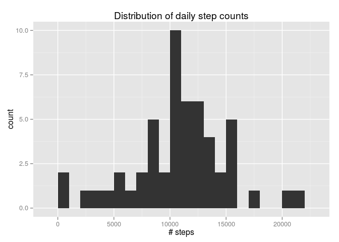
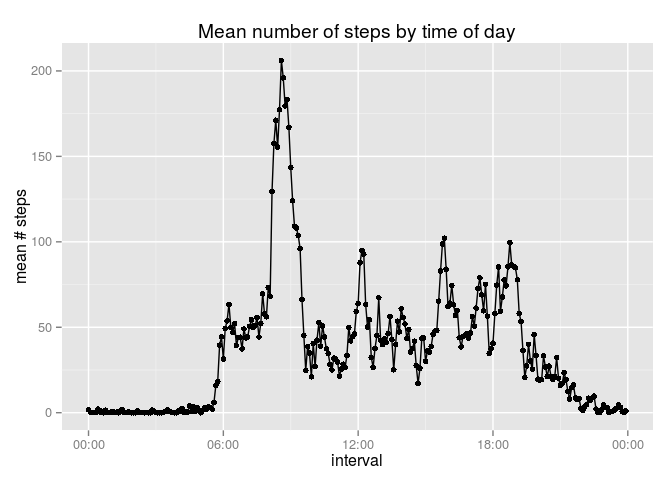
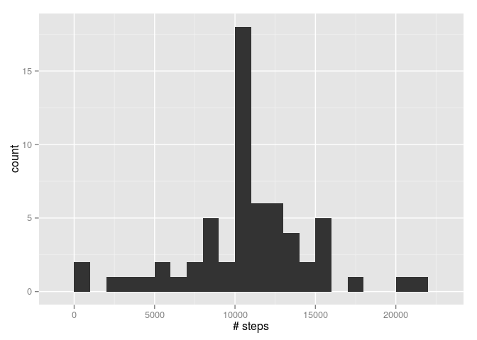
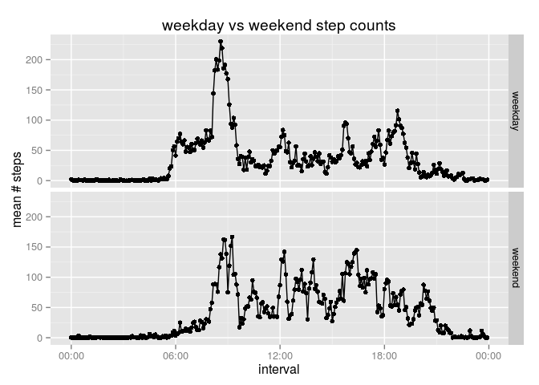

# Reproducible Research: Peer Assessment 1


```r
library(dplyr)
```

```
## 
## Attaching package: 'dplyr'
## 
## The following object is masked from 'package:stats':
## 
##     filter
## 
## The following objects are masked from 'package:base':
## 
##     intersect, setdiff, setequal, union
```

```r
library(ggplot2)
library(lubridate)
library(scales)
```

## Loading and preprocessing the data


```r
activity_data <- read.csv("activity.csv") %>%
  # Convert integer intervals to time values so we can plot them properly.
  # TODO(laixer): Any easier way to do this?
  mutate(interval = origin + 60 * (60 * (interval %/% 100) + interval %% 100))
```

## What is mean total number of steps taken per day?


```r
steps_by_date <- 
  activity_data %>% 
  filter(!is.na(steps)) %>% 
  group_by(date) %>% 
  summarize(total_steps = sum(steps))

ggplot(steps_by_date, aes(total_steps)) + 
  geom_histogram(binwidth = 1000) + 
  xlab("# steps") + 
  ggtitle("Distribution of daily step counts")
```

 

Mean steps:

```r
mean(steps_by_date$total_steps)
```

```
## [1] 10766.19
```

Median steps:

```r
median(steps_by_date$total_steps)
```

```
## [1] 10765
```

## What is the average daily activity pattern?


```r
steps_by_interval <- 
  activity_data %>% 
  filter(!is.na(steps)) %>% 
  group_by(interval) %>% 
  summarize(mean_steps = mean(steps))

ggplot(steps_by_interval, aes(interval, mean_steps)) + 
  geom_point() + 
  geom_line() + 
  scale_x_datetime(labels = date_format("%H:%M")) + 
  ylab("mean # steps") +
  ggtitle("Mean number of steps by time of day")
```

 

Interval with the highest average step count:

```r
format(steps_by_interval$interval[which.max(steps_by_interval$mean_steps)], 
       format = "%H:%M")
```

```
## [1] "08:35"
```


## Imputing missing values

Number of intervals with missing data:


```r
sum(is.na(activity_data$steps))
```

```
## [1] 2304
```

When data is missing, it's missing for entire days. A simple way to impute the 
data is to use the average for the given interval.


```r
mean_steps_for_interval <- function(interval) {
  # TODO(laixer): Find less ugly way to do this.
  return(steps_by_interval$mean_steps[steps_by_interval$interval == interval])
}

activity_data_imputed <- activity_data %>% 
  mutate(steps = ifelse(is.na(steps), 
                        sapply(interval, mean_steps_for_interval), 
                        steps))

steps_by_date_imputed <- 
  activity_data_imputed %>% 
  group_by(date) %>% 
  summarize(total_steps = sum(steps))

ggplot(steps_by_date_imputed, aes(total_steps)) + 
  geom_histogram(binwidth = 1000) + 
  xlab("# steps")
```

 

**Mean steps:**

```r
mean(steps_by_date_imputed$total_steps)
```

```
## [1] 10766.19
```

The mean has not changed, which is expected as the data for the missing days was
imputed from the mean steps from other days.

**Median steps:**

```r
median(steps_by_date_imputed$total_steps)
```

```
## [1] 10766.19
```

The median changed by a miniscule amount (to become equal to the imputed 
average) because we introduced a number of entries for the missing days all 
equal to the average number of steps.

## Are there differences in activity patterns between weekdays and weekends?


```r
activity_data_imputed <- activity_data_imputed %>% 
  mutate(day_of_week=weekdays(ymd(date)), 
         type_of_day=as.factor(ifelse(day_of_week %in% c("Saturday", "Sunday"), 
                                      "weekend", 
                                      "weekday")))

steps_by_interval_and_type_of_day <- 
  activity_data_imputed %>% 
  group_by(interval, type_of_day) %>% 
  summarize(mean_steps = mean(steps))

ggplot(steps_by_interval_and_type_of_day, aes(interval, mean_steps)) + 
  facet_grid(type_of_day ~ .) +
  geom_point() + 
  geom_line() + 
  scale_x_datetime(labels = date_format("%H:%M")) + 
  ylab("mean # steps") +
  ggtitle("weekday vs weekend step counts")
```

 
